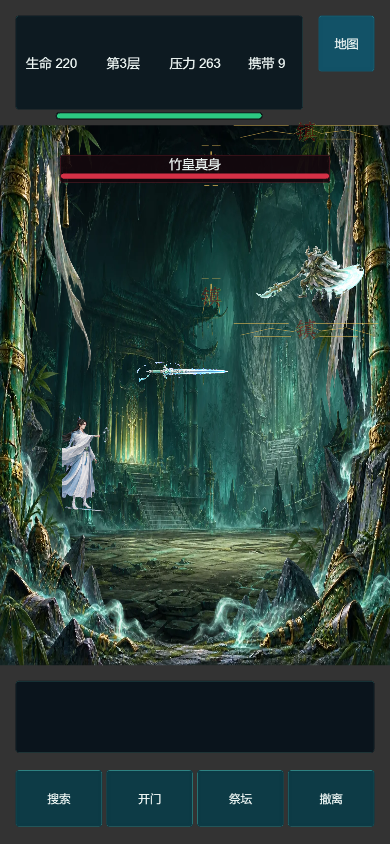
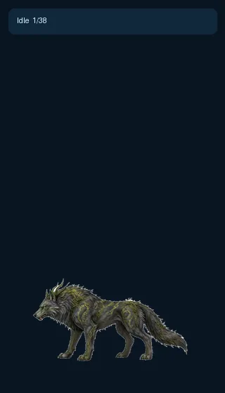
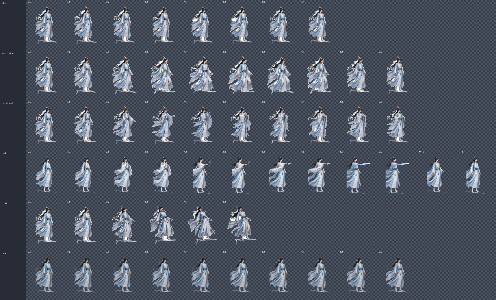
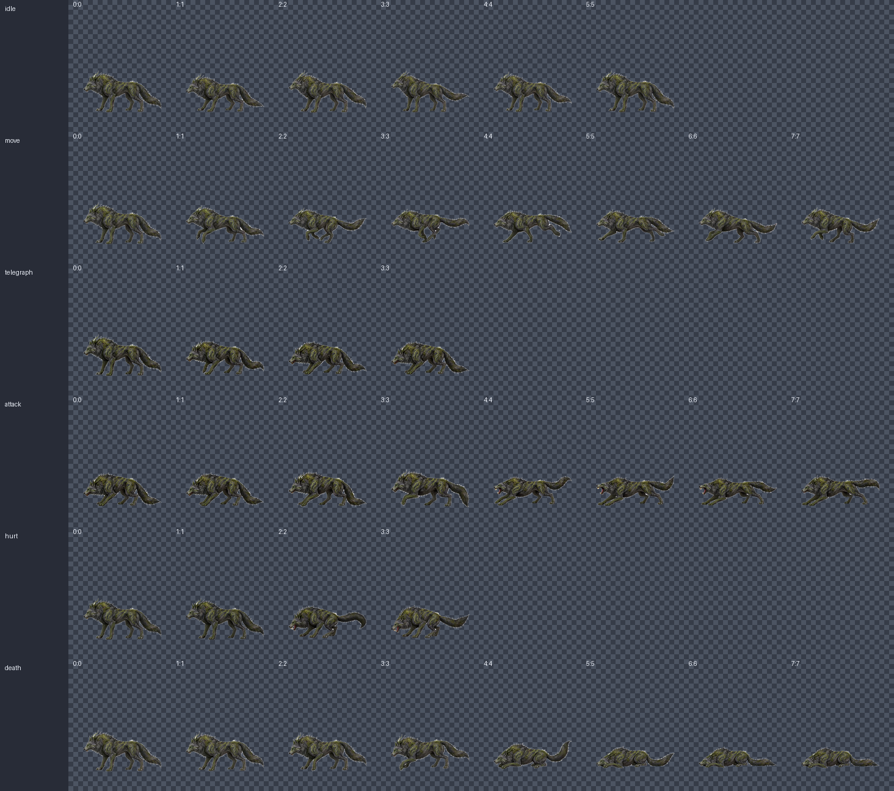
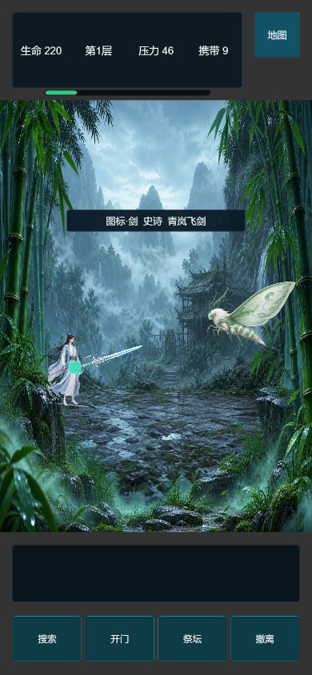
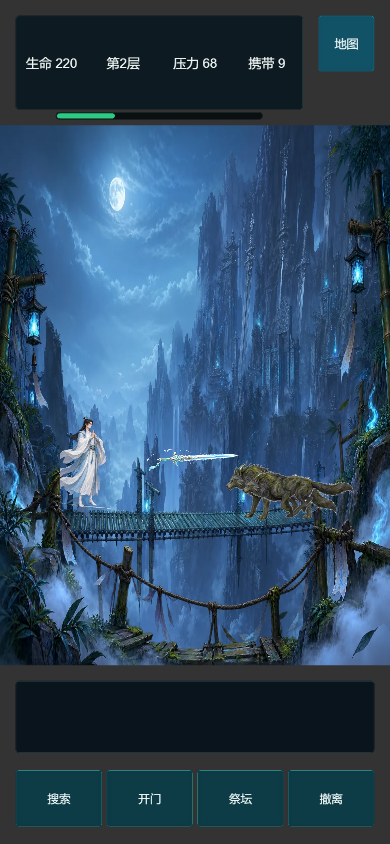
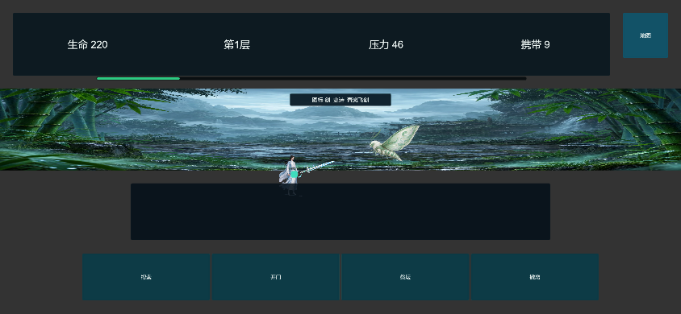

# H3 游戏动作资产试点验收报告

验收日期：2026-08-20

## 结论

青岚剑修与苔甲地狼的首批动作已由本地 MiniMax H3 视频生成、定点提帧并打包为 Cocos 动作图集。运行时已使用新图集，角色动作不再依赖整体前冲或额外拼接肢体；地狼的待机、移动、预警、撕咬、受击和死亡具有独立轮廓，撕咬伤害点与动作接触帧同步。

源视频仅作为可追溯中间资产，游戏仍加载 PNG 动作图集和动作清单，不在运行时解码视频。

## 生成环境

- H3 桥接服务：`0.33.0`，生成时和复验时状态均为 `ready`。
- ComfyUI：`0.33.0`，Linux，Python `3.12.3`，PyTorch `2.13.0+cu130`。
- 显卡：NVIDIA GeForce RTX 5090，显存 32 GB。
- 模型：`minimax-h3-fl2v-local`，画面 `768x1344`，5 秒，24 FPS。
- 路线决策：早期 Ref2V 试验因青岚身份与性别漂移被淘汰；最终使用首帧或首尾帧锁定身份的 FL2V。
- 云端调用：0；全部视频由本地 H3 服务生成。
- 生成清单 SHA-256：`049d3e104c4087bfff2f850cd0c7947c69f3f047b3590fe3788be4b8e1dfc8eb`。

## 生成任务

| 动作 | H3 任务号 | 种子 | 视频 SHA-256 |
| --- | --- | ---: | --- |
| 青岚·待机 | `920a74cb-2eca-46a1-b31f-64343b9d6a37` | 3082001 | `94be0dfff315d938dfad345b194be4169b4fafc833da7bdbc48689a6329a530b` |
| 青岚·御剑 | `105e5f1a-ff8b-45c6-8660-67404ee68d45` | 3082002 | `57bdc76cb5b13b6b066a1af43e1756c92dccbd02749c0bd891a5851dd05f88ab` |
| 青岚·掐诀 | `14859c36-416f-49d3-beed-197dbfb2f209` | 3082003 | `18e485b0a0bf7e146c73a048d55dc0dd406f07e579a7f89180e844da141c285f` |
| 青岚·受击 | `1aee4e94-f581-46b0-87f9-db3acd1ea594` | 3082004 | `096026a0a887543e969aec098e8ced9c2a090493a4097ac0ca1fed29736f74e1` |
| 地狼·待机 | `78063eba-6a07-4652-9813-570ed80732a7` | 3082005 | `ead4a815dc60f7bf0a5032585ba2db1404c13038c165964e188526f8e4f048f0` |
| 地狼·奔跑 | `c0d2ce7b-0e3e-41ca-9e24-a7ea4ac268a3` | 3082006 | `2d58624ef4e1a2c5aafd88acdab3b1d47fae731420adb2ed17fffcc2fc7cbe54` |
| 地狼·扑咬 | `0decadbd-26b9-4aed-9d5b-83e1e086032a` | 3082007 | `7b5fe89cecae7baa9ca7dd57aa1de9cbea12399cad9e7a9fd0a160f6cf83aca7` |
| 地狼·受击 | `633a3bfa-9868-422f-8f6d-8a24d4118e82` | 3082008 | `b4104bf9e44ce132c43337bcd7060e20cf82a7163126da6d799fa5fd55148035` |
| 地狼·死亡 | `295d314b-a535-4207-8543-2d4074d4d69e` | 3082009 | `b7cd1af1aae8efd5295532c5702f477df46e4655174244160e97c4e8d26767dc` |

提示词、参考图、采样时间和输出动作均由 `cocos-client/art-source/h3-pilot/pilot.json` 固定。青岚提取报告 SHA-256 为 `4ed494bf3f9f122d90b0fa380ca5515423b90f29764f9ba0fdd84d9d6ca80ea5`，地狼提取报告 SHA-256 为 `571280ea184060fd49008d43d08771eadf95b7e386ca3ddac5a36cb7d2e23fba`。

## 动作与运行时

- 青岚：H3 输出待机 8 帧、御剑 10 帧、掐诀 10 帧、受击 6 帧；原有施法与死亡动作继续保留。
- 苔甲地狼：H3 输出待机 6 帧、移动 8 帧、预警 4 帧、扑咬 8 帧、受击 4 帧、死亡 8 帧。
- 地狼扑咬事件设在动作进度 `0.55`，伤害判定跟随接触动作，不在起手阶段提前生效。
- 角色与怪物动作清单继续走统一 `AtlasAnimator` 契约，后续同类资产可沿同一生成、验收、晋升流程接入。
- 地狼源视频的白底残留采用仅对该角色启用的连通区域清理；没有放宽全局边界或尺寸质量阈值。

## 自动验证

- 全量测试：958 项，957 通过，0 失败，1 项按设计跳过。
- H3 生成、提帧、哈希、候选晋升、运行时标记及发布包防回退检查均包含在本次全量测试中并通过。
- Cocos 网页构建完整性检查：通过，主场景、脚本、H3 源清单和 12 个已构建 H3 图集逐项一致。
- 网页构建：353 个文件，49,360,101 字节；其中图片 43,936,619 字节。
- 运行资源：40.79 MB；副本资源 10.78 MB / 20 MB，处于预算内。
- 构建目录中的青岚待机与地狼扑咬图集和源图集逐字节一致。

## 浏览器试玩

| 视口 | 路线 | 结果 | P95 帧时间 | 最低采样 FPS | 错误 |
| --- | --- | --- | ---: | ---: | --- |
| 390x844 | balanced | 通过 | 7.00 ms | 140.8 | 0 |
| 844x390 | balanced | 通过 | 7.00 ms | 140.8 | 0 |

两种视口均完成副本进入、真实战斗、路线探索、三秒撤离和结算关闭；画布完整、比例一致、功能区位于安全区。竖屏为主要体验，横屏用于兼容性验证。

## 截图证据

### 旧版对照

### 动作预览

### 动作帧与新构建

原始浏览器记录：[竖屏报告](assets/h3-gameplay-animation-pilot/portrait-agent-report.md)、[竖屏证据 JSON](assets/h3-gameplay-animation-pilot/portrait-agent-evidence.json)、[横屏报告](assets/h3-gameplay-animation-pilot/landscape-agent-report.md)、[横屏证据 JSON](assets/h3-gameplay-animation-pilot/landscape-agent-evidence.json)。

## 淘汰与修正

- 淘汰过 Ref2V 身份漂移、女性化、主体触边、地狼肢体白块和死亡动作漂移过大的生成批次。
- 只对受影响动作使用局部容差；地狼受击最大尺寸漂移为 `0.14`，死亡最大中心漂移为 `0.14`、最大尺寸漂移为 `0.29`。
- 运行时不加入额外腿、翅膀或手部覆盖层，避免再次出现上下半身分离和假肢感。

## 剩余风险

无头浏览器性能数据可以发现明显回退，但不能替代抖音真机。发布前仍需在至少一台中端 Android 和一台 iPhone 上验证首包加载、内存峰值、触摸输入及连续多场战斗的温升与降频。
