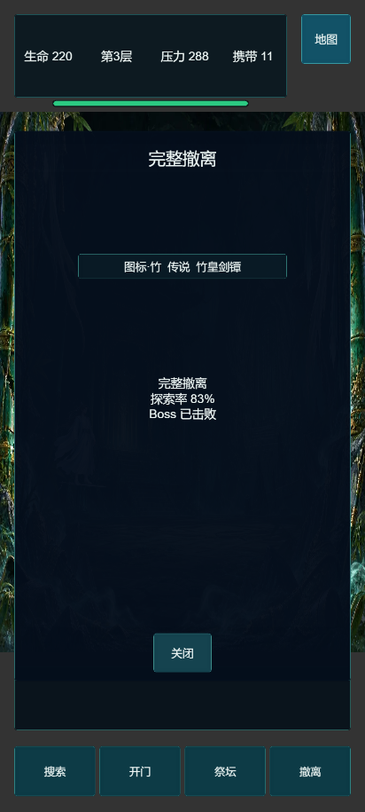
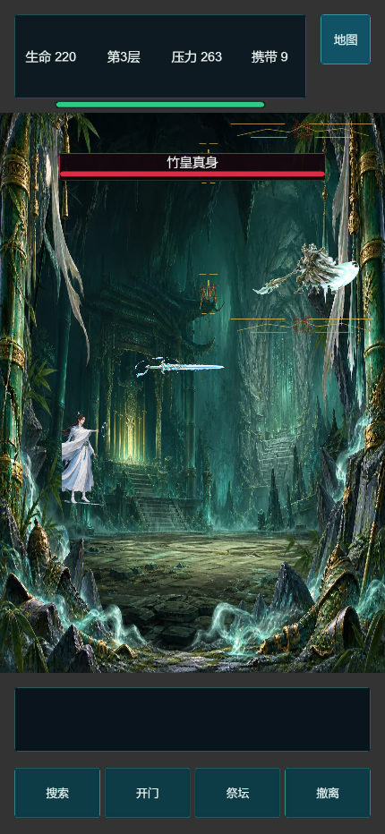
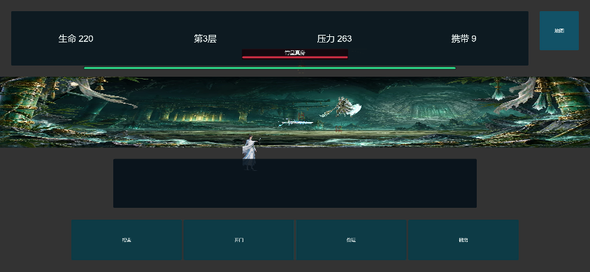

# M3 追击副本验收报告

验收日期：2026-08-19

## 结论

M3 追击副本网页构建通过自动规则、真实浏览器试玩、资源加载、画面比例和性能验收。安全撤离、均衡探索、完整探索三条路线均能完成手动结算；三层竹皇 Boss、飞剑宝库和完整撤离链路可达。

## 自动验证

- 全量测试：872 项，871 通过，0 失败，1 项按设计跳过。
- 100 局正式状态机种子模拟：100/100 成功撤离；种子实际驱动帧分段、伤害分段和断点恢复时机。
- 安全策略：34/34，平均搜索 0 次。
- 均衡策略：33/33，平均搜索 3 次。
- 贪心策略：33/33，平均搜索 5 次。
- Cocos 构建完整性：通过，主场景和运行脚本可解析。
- 网页构建：353 个文件，46.14 MB；文本预计 gzip 后约 1.02 MB。
- 副本资源：10.86 MB / 20 MB，包含 6 张背景、2 套特效、4 个音频和 16 个角色图集资源。

## 浏览器试玩

每个尺寸均执行 safe、balanced、greedy 三条路线，共 12 组，12/12 通过。所有运行均满足：

- Cocos 画布完整且未拉伸。
- HUD、地图、交互提示、命令栏和结算面板均处于安全区，横屏触控目标不小于 44px。
- 副本美术资源状态为 ready，无灰色占位和加载失败提示。
- 地图暂停、首个房间入口和手动关闭结算均通过画布真实点击验证。
- 三秒撤离和正式存档奖励提交正常，重复结算不会二次写入。
- 浏览器控制台错误、页面错误和网络失败均为 0。
- 普通战斗、追击战和 Boss 战技能运行期间的 P95 帧时间均为 7.0 ms，未出现持续低于 30 FPS 的区间。

| 尺寸 | safe | balanced | greedy |
| --- | --- | --- | --- |
| 390x844 | 通过 | 通过 | 通过 |
| 412x915 | 通过 | 通过 | 通过 |
| 430x932 | 通过 | 通过 | 通过 |
| 844x390 | 通过 | 通过 | 通过 |

## 截图证据

## 本轮发现并修复

- 修复 Cocos 将 Set/Map 展开错误编译为数组拼接，导致副本路线校验和资源路径失效的问题。
- 修复动态组件先执行 onLoad，副本存档回调未绑定的问题。
- 将第二次追击接入二层精英门，保证祭坛真身战前完成两次追击。
- 将二次追击并入精英门的同一次原子存档，修复进门后退出再恢复可能卡死的问题。
- 修复副本界面在未激活节点延迟执行 onLoad 时覆盖真实视口布局的问题。
- 横屏布局改用与 Cocos SHOW_ALL 一致的缩放比例，并把命令栏纳入安全区。
- 将竹皇通用攻击动作映射到已有横扫序列帧，消除缺失动作报错。
- 清理竹皇源序列帧白边和离散碎片，并校正实际帧尺寸。
- 自动试玩新增资源 ready、画布比例、功能区边界、真实按钮点击、战斗期性能和手动结算检查。

## 剩余风险

浏览器无头性能数据用于发现明显回退，不能替代抖音真机性能测试。发布前仍需在至少一台中端 Android 和一台 iPhone 上确认首包加载、音频解锁、触摸输入与内存峰值。
